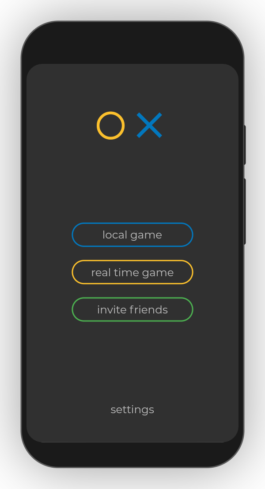
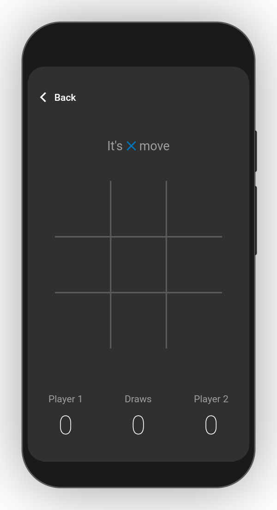

# Tic-Tac-Toe

Simple game created in Flutter

## Table of contents

- [General info](#general-info)
- [Technologies](#technologies)
- [Setup](#setup)

## General info

The purpose of this project was to practice Flutter development by creating simple mobile game.

## Technologies

Project is created with:

- Flutter version: 1.20.0
- Dart version: 2.9.0
- Provider version: 4.3.2+2
- Flutter_screenutil version: 3.1.0
- Device_preview version: 0.4.8

## Screenshots





## Setup

To run this project follow these steps:

1. Clone the repository

```
$ git clone https://github.com/kubacarbon/TicTacToe.git
```

2. Open the project

```
$ cd TicTacToe
```

3. Install dependencies

```
flutter pub get
```

4. Run app

```
$ flutter run
```
