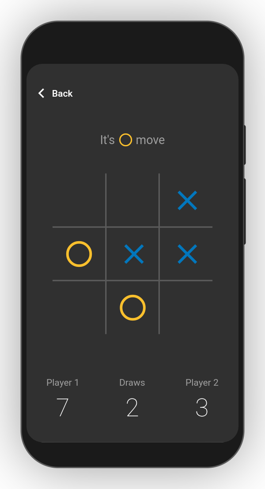

# :beginner: Tic-Tac-Toe

Simple mobile game created in Flutter.

## :book: Table of contents

- [General info](#general-info)
- [Technologies](#technologies)
- [Screenshots](#screenshots)
- [Setup](#setup)

## :pencil: General info

The purpose of this project was to practice Flutter development by creating simple mobile game.

## :gear: Technologies

Project is created with:

- [Flutter](https://flutter.dev/) version: 1.20.0
- [Dart](https://dart.dev/) version: 2.9.0
- [Provider](https://pub.dev/packages/provider) version: 4.3.2+2
- [Flutter_screenutil](https://pub.dev/packages/flutter_screenutil) version: 3.1.0
- [Device_preview](https://pub.dev/packages/device_preview) version: 0.4.8

## :camera_flash: Screenshots

  

## :computer: Setup

To run this project follow these steps:

1. Clone the repository

```
$ git clone https://github.com/kubacarbon/TicTacToe.git
```

2. Open the project

```
$ cd TicTacToe
```

3. Install dependencies

```
flutter pub get
```

4. Run app

```
$ flutter run
```
